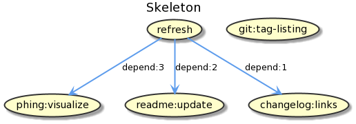

Dev notes
=========



Testing the plugin
------------------

To test the current library while developing it's useful to  crate a new 
`dummy-app` project:

```
Projects
├── skeleton (this project)
│   └── ...
└── dummy-app
    └── composer.json
```

The content of `composer.json` would be:

```json
{
    "name": "jawira/dummy-app",
    "require": {
        "jawira/skeleton": "*"
    },
    "repositories": [
        {
            "type": "path",
            "url": "/home/jawira/PhpstormProjects/skeleton",
            "options": {
                "symlink": false
            }
        }
    ],
    "minimum-stability": "dev",
    "prefer-stable": true
}
```

Usually you will execute the following command to easily test the plugin.

```bash
rm -rf vendor composer.lock README.md; composer install
```

Sources:
 
- [https://getcomposer.org/doc/05-repositories.md#path]()
